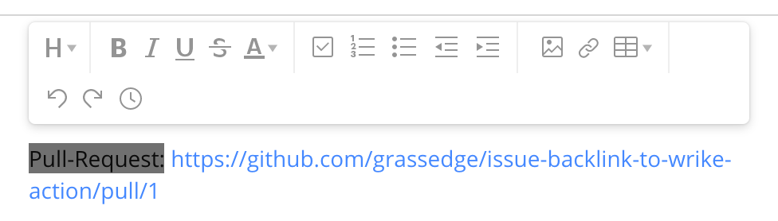

# Issue backlink to Wrike task

Write the backlink of the GitHub issue to the description of Wrike tasks.

If your team currently uses GitHub and Wrike, this actions is useful to tie issues to wrike tasks.
When the url of wrike task is written on the issue description,
this GitHub Action creates the link on the description of the wrike task that is specified by the url.

## Usage

This Action subscribes to Pull request events specifically the opened and edited events which fire whenever issues are created or issue descriptions are edited.

```workflow
name: Create backlinks of issues.
on:
  pull_request:
    types: [opened, edited]
jobs:
  issue-backlink-to-wrike:
    runs-on: ubuntu-latest
    steps:
    - name: Issue backlink to wrike
      uses: grassedge/issue-backlink-to-wrike-action@1.0.0
      env:
        WRIKE_ACCESS_TOKEN: ${{ secrets.WRIKE_ACCESS_TOKEN }}
```

## Demo



## License

The Dockerfile and associated scripts and documentation in this project are released under the [MIT License](LICENSE).
